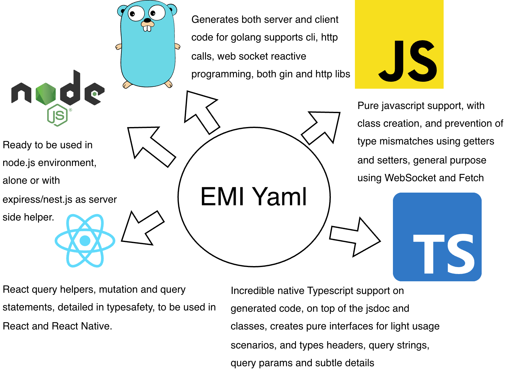

# Emi - Backend-for-Frontend with automatic SDK generation.

Live preview: https://torabian.github.io/emi/playground
Documentation: https://torabian.github.io/emi

Backend for front-end code generation library based on Emi definition files. Define http actions, dtos, enums, and
other sharable details with a single yaml definition, and then compile multiple
targets out of the same definition. Golden tool for creating SDKs which work
with an API system.

Main focus is on **JavaScript, TypeScript, Golang** environment, also supports a basic
version of **Swift** and **Kotlin** which is more limited (PR Welcome)

Code written in Emi aims to be framework agnostic, but still there are following
libraries used:

- React.js code flag. Emi generates react.js, and tanstack react query code,
upon flag `react` provided to `js` compiler. You can change the library import
location, or version, if needed.
- On Golang side, code generated uses `Gin` and possibly `urfave/cli` for giving
context on cli status, which are both very well known and mature libraries.
- On js side, `qs` has been used for parsing query strings.
- Small amount of helpers are added for next.js, upon providing `--tags nextjs` for
js compiler, which is a famous backend framework on node.js. Helps
to use the classes generated directly in req, headers arguments.

Notes:
- Golang and JavaScript(Ts) are having an special focus.
- Emi generates most type-safe javascript code, which ensures typesafety through
class generation of dtos which is very unique feature.
- Kotlin and Swift compilers require more work, you can modify them and open a pull
request.



## Live playground: https://torabian.github.io/emi 

You can try to compile Emi live here: https://torabian.github.io/emi/playground
Emi is written in Golang, and wasm file exported to be used in javascript environment (only for generation, no runtime needed.)

## Installation


### For general purpose:

You can download the binaries from releases section of github for desired application.


### For Golang Fans

If you have golang setup already, then you can use:

```bash
go install github.com/torabian/emi/cmd/emi@latest
```

and it would install emi command globally.

### For Js fans

Emi also is published on npm as well, but a bit behind sometimes from the releases.
You can use following command but recommended is to install it via binaries from releases:

```
npx emicc
```


## Feature support in a glance.

| Feature / Language        | Golang | JavaScript | JavaScript (TS) | JavaScript (Node.js) | Kotlin | Swift | Notes |
|----------------------------|--------|------------|----------------|---------------------|--------|-------|-------|
| DTO Generation             | ✅     | ✅         | ✅             | ✅                  | ✅     | ✅    | Supported in all languages |
| HTTP Actions               | ✅     | ✅         | ✅             | ✅                  | WIP     | WIP    | Works with HTTP client libraries |
| Command Line               | ✅     | ❌         | ❌             | ❌                  | ❌     | ❌    | Only Golang has CLI support currently |


## Emi syntax

Emi is a yaml file, and here you can find the complete schema:
- https://github.com/torabian/emi/blob/main/playground/public/emi-module-spec.json

You can use the definition with Redhat yaml plugin in the vscode.
