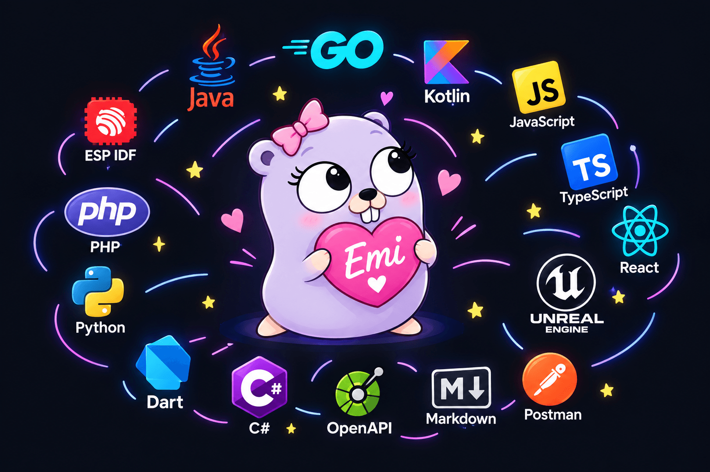

# Emi Compiler

### One YAML API definition → type-safe Go, TypeScript, Swift, Kotlin, Python, Dart, C#, Java, PHP, C & C++ SDKs

**Live playground:** https://torabian.github.io/emi/playground — try Emi in the browser, no install needed.

Emi is a code generator: you describe your API once — dtos, entities, actions, config —
in a single yaml file, and Emi compiles that one definition into working, type-safe code
for multiple languages, so the backend and every client SDK are always generated from
the same source of truth and never drift out of sync with each other.

It's a good fit whenever one API needs to reach several runtimes and you don't want the
DTOs to drift: a Go/Gin backend paired with a TypeScript web app, a mobile app (Swift/
Kotlin), and a desktop or CLI client from the same definition; a game (Unreal Engine) or
an embedded device (ESP-IDF/Arduino) talking to that same backend over real WebSockets;
or an internal service whose contract needs to be shared, unambiguously, across a
polyglot team without hand-syncing types in every language by hand. It also fits
projects that need to publish an **SDK** for their API in several languages at once, or
need a **CLI** generated straight from the same action definitions the HTTP API already
exposes — both come out of the same yaml, with no separate spec to maintain.



Beyond basic DTO/action generation, Emi's goal is to cover the topics that usually get
bolted on by hand afterwards: **reactive programming** (real WebSocket/SSE actions,
typed on both ends), **nullability** (nullable-aware types across every target),
**envelopes** (a consistent response-wrapper shape, e.g. Google's JSON style guide),
**translations** (string-resource generation across languages), a first-class **CLI**
(Golang actions double as `urfave/cli` commands for free), and **WASM** (the same
compiler runs in the browser, no server round trip).

## Quick start

**1. Install Emi**

```bash
go install github.com/torabian/emi/cmd/emi@latest
```

(or download a prebuilt binary from the [releases](https://github.com/torabian/emi/releases) page)

**2. Create the sample yaml**

Save this as `user.emi.yml`:

```yaml
complexes:
  - name: Money
    compiler: go
    location: github.com/torabian/emi/examples/fullstack/sdk/complexes
    namespace: complexes

dtos:
  - name: address
    fields:
      - name: city
        type: string
      - name: zip
        type: string?

  - name: user
    fields:
      - name: id
        type: string
      - name: email
        type: string
      - name: age
        type: int?
      - name: tags
        type: slice
        primitive: string
      - name: addresses
        type: collection
        target: AddressDto
      - name: balance
        type: complex
        complex: Money
```

`dtos` is a list of data-transfer object definitions — each one gets its own generated
class/struct, one per target language. `fields` are plain, typed properties, and a
trailing `?` (as in `int?`, `string?`, `collection?`) marks any field nullable, which
every compiler renders the idiomatic way for that language (`*int` in Go, `int?` in
Swift/C#, `Optional[int]` in Python, ...). A few field shapes worth knowing:

- **Scalars** — `string`, `int`, `bool`, `float`, ...
- **`slice`** — a homogeneous list of a `primitive` scalar (here, `tags: []string`).
- **`array`** — a fixed-shape list where each item is itself an inline object (declared
  with its own nested `fields`).
- **`collection` / `one`** — a relation to another dto/entity via `target:` (`collection`
  is many, `one` is a single reference) — `addresses` here becomes `[]AddressDto` (or
  the equivalent per language).
- **`complex`** — an escape hatch to a hand-written type declared under `complexes:`,
  imported from a real language-native location instead of generated.

**3. Compile it to multiple languages**

```bash
emi go     --path user.emi.yml --output ./out/go
emi js     --path user.emi.yml --output ./out/js --tags typescript
emi swift  --path user.emi.yml --output ./out/swift
emi python --path user.emi.yml --output ./out/python
```

Each command reruns the same `user.emi.yml` through a different target compiler and
writes matching, type-safe code to its own output folder. You can also list every
target once, under `targets:`, in the yaml itself and compile them all in one shot
with `emi compile --path user.emi.yml`.

## Emi YAML at a glance

A `.emi.yml` module is just a grouping of top-level blocks — this is the "table of
contents" every compiler (Go, JS, Swift, ...) walks:

| Block       | What it's for                                                                                                     |
| ----------- | ----------------------------------------------------------------------------------------------------------------- |
| `namespace` | Where the module lives in the app tree (PHP-style), used as the client export path.                               |
| `dtos`      | Plain data-transfer objects — shared shapes for request/response bodies.                                          |
| `entities`  | Database-backed structs; fields become Go struct fields and DB columns, and feed auto-synthesized CRUD actions.   |
| `complexes` | Custom data types that don't fit the built-in field types.                                                        |
| `actions`   | Controller-like units of behavior (HTTP and/or CLI), with typed `in`/`out` bodies.                                |
| `remotes`   | Typed definitions of external HTTP services the module calls.                                                     |
| `config`    | Typed server config, good for casting `.env` values.                                                              |
| `manifests` | Bundles of actions (include/exclude patterns) shippable as one unit (`go-client`, `go-gin`, `go-cli`, `go-wasm`). |
| `vsqls`     | Hand-written SQL paired with a generated typed parameter struct.                                                  |
| `targets`   | Self-contained compiler targets bundled with the module, for one-shot `emi compile`.                              |
| `templates` | Reusable dto/action shapes, never compiled on their own — only referenced (e.g. via `captures`).                  |

Full schema: https://github.com/torabian/emi/blob/main/playground/public/emi-module-spec.json
(works with the Red Hat YAML extension in VS Code for autocomplete/validation).

## Language targets & features

| Target                      | What you get                                                                                                                                                                                |
| --------------------------- | ------------------------------------------------------------------------------------------------------------------------------------------------------------------------------------------- |
| **Golang**                  | Full server + client: DTOs, `Gin` HTTP handlers, `urfave/cli` CLI, GORM entities, reactive/WebSocket support. The only target that generates a server.                                      |
| **JavaScript / TypeScript** | Typed client SDK (vanilla or React + TanStack Query hooks), typed `fetch` layer, JSDoc typedefs for plain JS, reactive WebSocket/SSE hooks, NestJS decorators. Runs in the browser or Node. |
| **Swift**                   | `Codable` DTO structs, typed header structs, typed WebSocket client for reactive actions. HTTP actions are WIP.                                                                             |
| **Kotlin**                  | Typed DTO/action client code. Reactive/WebSocket not yet supported.                                                                                                                         |
| **Python**                  | `dataclasses`-based DTOs, `httpx` HTTP client (sync or async), SSE for reactive actions.                                                                                                    |
| **Dart**                    | DTO classes with hand-generated `toJson`/`fromJson`, `package:http` client, SSE for reactive actions.                                                                                       |
| **C#**                      | `System.Text.Json`-based DTOs, `HttpClient` transport, SSE via `IAsyncEnumerable<string>`.                                                                                                  |
| **Java**                    | Jackson-based DTOs, `java.net.http.HttpClient` transport, SSE for reactive actions.                                                                                                         |
| **PHP**                     | Reflection-based DTO hydration, `curl` HTTP transport, SSE for reactive actions.                                                                                                            |
| **C**                       | Vendored `cJSON` (de)serialization, `libcurl` transport. No nullable value types without pointers (documented scope limit).                                                                 |
| **C++ (generic)**           | Portable ISO C++17 DTOs/actions for desktop, ESP-IDF, and Arduino; `IEmiHttpTransport` seam; real RFC 6455 WebSocket client for reactive actions.                                           |
| **C++ (Unreal Engine)**     | `USTRUCT`/`UPROPERTY` DTOs usable from Blueprint, Unreal's own JSON reflection, async HTTP via `FHttpModule`, real WebSocket via `IWebSocket`.                                              |

Every target except Golang is client-only — no server, no CLI, and no entity/GORM
persistence is ever generated for them. Shared across all targets: nullable-aware
types, nested object/array/map fields, `one`/`collection` relations, and enums.

---

Documentation: https://torabian.github.io/emi
