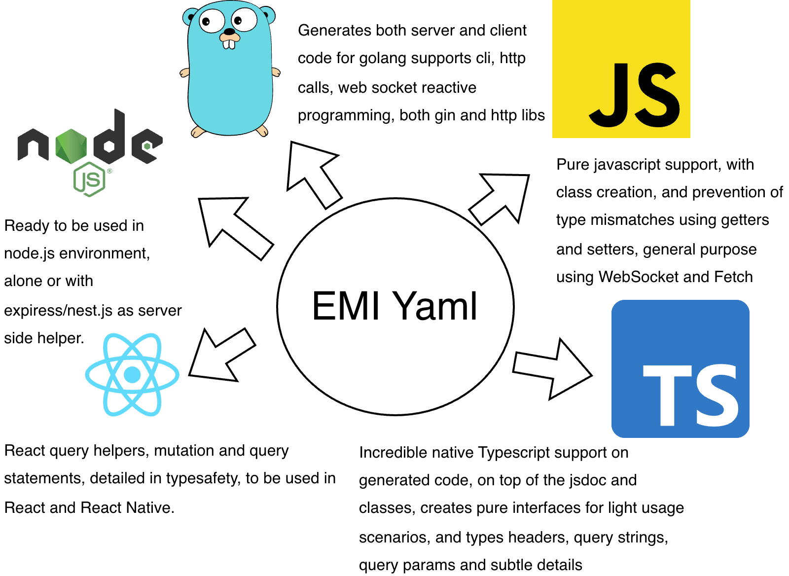

# Emi - Only SDK generation tool for API you need

Live preview: https://torabian.github.io/emi/playground
Documentation: https://torabian.github.io/emi

## What is Emi?

Emi is a code generator: you describe your API once, in one yaml file (dtos, entities,
actions, config, ...), and Emi compiles that single definition into working, type-safe
code for multiple languages — a matching backend and client every time, generated by
the same tool from the same source of truth.

- **One definition, many targets.** Golang gets first-class treatment (it's both the
  primary backend target and one of the client targets). JavaScript/TypeScript is the
  other special-focus target. Swift and Kotlin are supported as client/frontend targets,
  with Swift ahead of Kotlin.
- **Generated JS/TS can run on Node.js too**, but that's a side effect, not the goal —
  JS/React/Kotlin/Swift are meant to be clients, not server implementations.
- **Framework-light, not framework-free.** Golang output leans on `Gin` (HTTP) and
  `urfave/cli` (CLI); JS output leans on `qs` for query strings and optionally
  TanStack Query for React. All swappable/configurable, not hard requirements.

## How it works

```
   your-module.emi.yml                (1) DEFINE
          │            dtos, entities, actions, config, vsqls, manifests...
          ▼
   core.Emi.Preprocess()              (2) PREPROCESS  — lib/core/preprocess*.go
          │            resolves captures, synthesizes entity dtos/CRUD actions
          ▼
   ┌────────┬────────┬────────┬───────────────┐
   │  go     │  js/ts  │ swift  │ kotlin (WIP)  │   (3) COMPILE — pick a target
   └────────┴────────┴────────┴───────────────┘
          │
          ▼
   *.go / *.ts / *.swift files        (4) OUTPUT — ready-to-use, type-matched code
```

1. **Define** — write one `.emi.yml` module (see [Emi syntax](#emi-syntax)).
2. **Preprocess** — Emi expands anything "derived" (captures, entity CRUD synthesis)
   into a fully resolved module, once, before any language-specific work happens. You
   can inspect this step's output directly via the `preprocessor` action.
3. **Compile** — run the module through one or more target compilers (`go`, `js`,
   `swift`, ...), each implementing the same `core.PublicAPIActions` contract.
4. **Output** — a set of virtual files written to disk (or returned over wasm), ready
   to drop into a Go server, a TS/React app, or a Swift client.

Everything is available both as a native CLI binary and as a **wasm build**, so the
exact same compiler runs in the browser (see the live playground) with no server round
trip — codegen only, no runtime dependency on wasm afterwards.



## Installation

### For general purpose:

You can download the binaries from releases section of github for desired application.

### Building from source if Go is installed.

If you have golang setup already, then you can use:

```bash
go install github.com/torabian/emi/cmd/emi@latest
```

and it would install emi command globally.

## Feature map at a glance

| Feature / Language | Golang | JavaScript | JavaScript (TS) | JavaScript (Node.js) | Kotlin | Swift | Notes                                 |
| ------------------- | ------ | ---------- | ---------------- | --------------------- | ------ | ----- | -------------------------------------- |
| DTO generation       | ✅     | ✅         | ✅               | ✅                    | ✅     | ✅    | Supported in all languages             |
| HTTP actions         | ✅     | ✅         | ✅               | ✅                    | WIP    | WIP   | Works with HTTP client libraries       |
| Reactive / WebSocket | ✅     | ✅         | ✅               | ✅                    | ❌     | ✅    | `method: reactive` actions             |
| Command line         | ✅     | ❌         | ❌               | ❌                    | ❌     | ❌    | Only Golang has CLI support currently  |
| Entity → CRUD + GORM | ✅     | —          | —                | —                     | —      | —     | Auto-synthesized during preprocessing  |

Other cross-cutting features, independent of target language:

- Strong, nullable-aware data types (string, int, float, bool, enum, object, array,
  one/collection relation, map, slice) as first-class citizens.
- Type-safe headers, query params, and nested query params.
- Envelope system for API responses (e.g. Google JSON style guide), separating payload
  from wrapper.
- Extends the generated HTTP API and can be "ejected" (hand-edited) at any time.

## Core building blocks (`lib/core/Emi.go`)

Every `.emi` yaml module compiles down to one Golang struct, `core.Emi` — the root every
compiler (js, go, swift, ...) walks. It's just a grouping of the pieces below; think of
it as the "table of contents" of a module:

| Block        | What it is                                                                                   |
| ------------ | --------------------------------------------------------------------------------------------- |
| `namespace`  | Where the module lives in the app tree (PHP-style), used as the client export path.           |
| `dtos`       | Plain data-transfer objects — shared shapes for request/response bodies.                      |
| `entities`   | Database-backed structs. Fields become both Go struct fields and DB columns; feed into the preprocessor's CRUD/dto synthesis. |
| `complexes`  | Custom data types that don't fit the built-in field types.                                    |
| `actions`    | Controller-like units of behaviour (HTTP and/or CLI), with typed `in`/`out` bodies.            |
| `remotes`    | Typed definitions of external HTTP services the module calls.                                 |
| `config`     | Typed server config, good for casting `.env` values.                                          |
| `manifests`  | Bundles of actions (include/exclude patterns) shippable as one unit (`go-client`, `go-gin`, `go-cli`, `go-wasm`). |
| `vsqls`      | Hand-written SQL paired with a generated typed parameter struct.                              |
| `targets`    | Self-contained compiler targets bundled with the module.                                      |
| `templates`  | Reusable dto/action shapes that are never compiled by themselves — only referenced (e.g. as a `captures` source). |

## Preprocessor (`lib/preproceesor`, `lib/core/preprocess*.go`)

**What it's for:** expand derived/shorthand definitions into a fully resolved module
*before* any language compiler runs, so every generator sees the same, complete
picture. Idempotent (safe to run twice). Runnable standalone via the `preprocessor`
action if you want to see exactly what a compiler will see.

| Capability            | What it does                                                                                                     |
| ---------------------- | ------------------------------------------------------------------------------------------------------------------ |
| **Captures**           | Build a vsql's params, or a dto/action's fields, by pulling from another dto, a `templates` dto, or an existing action's `in`/`out` body — instead of redeclaring them. Supports `include`/`exclude` and the `self.fields` token to splice in the owner's own inline fields at a specific spot. |
| **Entity → optional dto** | Every entity gets an auto-generated `{Entity}OptionalDto` with every field's nullable counterpart (for partial updates/filters). |
| **Entity → update dto**   | A plain update dto synthesized from the entity's fields.                                                       |
| **Entity → CRUD actions** | Create / Update / Get / Browse / AwareDelete `EmiAction`s, wired to the entity's generated types and appended to `module.Actions` — they flow through the exact same HTTP/CLI/envelope codegen as hand-written actions. A hand-declared action with the same name always wins, so this is a convenience default, not a hard rule (the generated stub still needs a real Go function body). |

## JavaScript / TypeScript (`lib/js`)

**What it's for:** typed client SDKs — vanilla JS/TS, or React + TanStack Query.

| Action                                        | What it generates                                                        |
| ---------------------------------------------- | -------------------------------------------------------------------------- |
| `js:fields` / `js:dto:class`                   | A class from raw fields, or from a dto definition.                        |
| `js:action`                                    | A complete action (request builder, types), standalone.                   |
| `js:headers`                                   | A typed header class.                                                     |
| `js:sdk`                                       | Just the shared JS/TS SDK runtime folder.                                 |
| `js` / `js:module`                             | The whole module, as a set of files ready to write to disk.               |

Capabilities:

- Real TypeScript **classes** for DTOs (not just `interface`s) — type mismatches are
  caught at the class level, with full nullability/collection/object/array support.
- A typed `fetch` layer over the browser fetch API that returns class instances, not
  raw JSON.
- `--tags react` → TanStack Query `useQuery`/`useMutation` hooks, query-option builders,
  and reactive WebSocket/SSE hooks. Import location/version configurable
  (`--react-query react-query@v3`).
- `WebSocketX` runtime + SSE hooks for `method: reactive` actions (mirrored in Go and
  Swift).
- `qs`-based type-safe query strings, including nested params.
- `--tags nextjs` → helpers so generated classes plug directly into `req`/`headers`.
- Optional NestJS static decorators/metadata classes per action.
- `--js-sdk-location`, `--discard-type-prefix` flags to control SDK import paths and
  TypeScript `type`-import emission.

## Golang (`lib/golang`)

**What it's for:** the primary backend target — full server *and* client from the same
definition.

| Action              | What it generates                                                                 |
| -------------------- | ------------------------------------------------------------------------------------ |
| `go:dto`             | A single dto struct, client + server side.                                          |
| `go`                 | The whole module: dtos, entities, actions, vsqls, manifests, config.                |

Capabilities:

- HTTP handlers rendered against `Gin`, CLI commands against `urfave/cli`, plus
  WASM-friendly renders — three surfaces from one `EmiAction`, auto-registered on a
  global CLI via `gorunner`.
- Entities render into **GORM-ready structs**: `one`/`collection` relations become real
  GORM has-many/belongs-to associations with linker/id columns, ready for
  `gorm.AutoMigrate`.
- Full reactive/WebSocket support for `method: reactive` actions (dedicated gin-side and
  client-side renderers).
- Vsql compiler turns each `EmiVsql` into a params-DTO struct, a `Prepare<Name>Vsql`
  helper, and raw SQL/name constants — the SQL itself stays hand-written, only the
  parameter binding is generated.
- Manifests compile to selectable build targets (`go-client`, `go-gin`, `go-cli`,
  `go-wasm`).
- Deterministic, `gofmt`-formatted output with deduplicated/sorted imports.

## Swift (`lib/swift`)

**What it's for:** typed iOS/macOS (and other Swift) clients. Newer than Go/JS — HTTP
actions and complex-type discovery are still WIP; contributions welcome.

| Action           | What it generates                                                         |
| ----------------- | ----------------------------------------------------------------------------- |
| `swift:dto`       | A dto struct.                                                                 |
| `swift:headers`   | A header struct.                                                              |
| `swift`           | The whole module: dtos, actions, and shared runtime files.                    |

Capabilities:

- `Codable`-based dto generation, with an `AnyCodable` helper for loosely-typed fields.
- `EmiWebSocketX<Send, Receive>` — a typed wrapper around `URLSessionWebSocketTask` that
  re-arms Foundation's single-shot receive handler, giving `method: reactive` actions
  the same "keep listening" behaviour as the JS/Go WebSocket runtimes, fully typed via
  the same generated Codable dtos.
- A generated client config file, shared across every action in the module.
- Import handling respects Swift's whole-target compilation model: only real external
  modules (e.g. `Foundation`) get an `import`, never sibling generated types.

## Emi syntax

Emi is a yaml file, and here you can find the complete schema:

- https://github.com/torabian/emi/blob/main/playground/public/emi-module-spec.json

You can use the definition with Redhat yaml plugin in the vscode.
